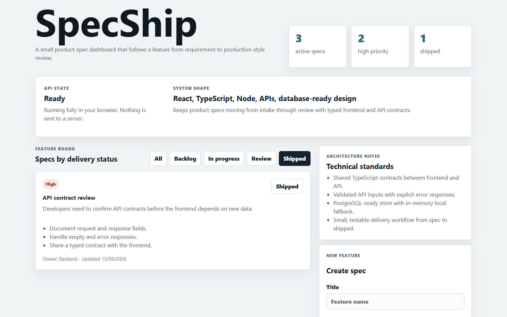
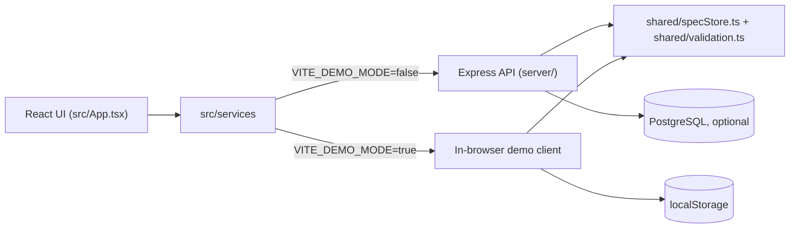

# SpecShip

SpecShip is a product-spec tracker. Small teams use it to move a feature from
a written requirement through review to shipped, with one shared view for
owner, priority, and delivery status.

[](https://github.com/Taan1el/specship/actions/workflows/ci.yml)
[](https://github.com/Taan1el/specship/actions/workflows/pages.yml)
[](LICENSE)

**Live demo:** https://taan1el.github.io/specship/

The demo runs entirely in your browser: no backend, sample data seeded on
load, and a "Reset demo data" control if you want to start over.

## Screenshot



More in [docs/screenshots](docs/screenshots).

## Features

- Board of product specs with owner, priority, requirement, and acceptance
  criteria, filterable by delivery status (`Backlog`, `In progress`,
  `Review`, `Shipped`).
- Move a spec to its next delivery status with one click.
- Create a spec from a form; the API validates the input and rejects
  incomplete or too-short fields with a specific message.
- Live counts of active, high-priority, and shipped specs.
- Works two ways from the same code: against the real Express API, or fully
  in the browser in demo mode (see [docs/architecture.md](docs/architecture.md#demo-mode)).

## Getting started

Prerequisites: Node.js 24 or later (tested with 24.14.1) and npm 11 or later
(tested with 11.11.0). No database is required for local development; the
API falls back to an in-memory store when `DATABASE_URL` is not set.

Install dependencies:

```bash
npm install
```

Start the API (defaults to port 4175):

```bash
npm run dev:api
```

Start the frontend in another terminal (defaults to port 5173, and proxies
`/api` to the address above):

```bash
npm run dev
```

Open http://localhost:5173.

### Environment variables

All variables are optional. See [.env.example](.env.example).

| Variable | Used by | Default | Purpose |
| --- | --- | --- | --- |
| `PORT` | `npm run dev:api`, `npm run start:api` | `4175` | Port the Express API listens on. |
| `DATABASE_URL` | `npm run dev:api`, `npm run start:api` | unset | PostgreSQL connection string. Without it, the API uses an in-memory store. |
| `VITE_API_TARGET` | `npm run dev` | `http://127.0.0.1:4175` | Where the Vite dev server proxies `/api` requests. Dev only. |
| `VITE_DEMO_MODE` | `npm run build:pages` | `true` (set in `.env.pages`) | Switches the frontend to the in-browser demo client instead of the real API. |

## Scripts

| Script | What it does |
| --- | --- |
| `npm run dev` | Start the Vite dev server for the frontend. |
| `npm run dev:api` | Start the Express API with `tsx`. |
| `npm run build` | Type-check and build the frontend (`dist/`) and the API (`dist-server/`). |
| `npm run build:pages` | Build the static demo site for GitHub Pages (`dist/`), with demo mode on and the `/specship/` base path. |
| `npm run lint` | Run `oxlint`. |
| `npm run start:api` | Run the compiled API from `dist-server/`. Used by the Docker image. |
| `npm test` | Run the Vitest suite. |
| `npm run preview` | Serve the last `npm run build` output locally. |

## How it works

`shared/spec.ts` defines the one `ProductSpec` type that the frontend and API
both use. `shared/specStore.ts` (the in-memory store) and
`shared/validation.ts` (the Zod schemas) have no Node-only dependencies, so
the same code runs inside the Express server and inside the browser.

The frontend never calls `fetch` directly. It goes through `src/services`,
which exposes one function per API route and picks an implementation based
on `VITE_DEMO_MODE`:



```
specship/
├── src/            React UI, and the API/demo client in src/services
├── shared/         Types, the in-memory store, and validation used by both sides
├── server/         Express API and the PostgreSQL store
├── docs/           Architecture notes, demo guide, screenshots
└── .github/        CI and GitHub Pages workflows
```

## API reference

A `ProductSpec` looks like this:

```ts
{
  id: string
  title: string
  owner: string
  status: 'Backlog' | 'In progress' | 'Review' | 'Shipped'
  priority: 'Low' | 'Medium' | 'High'
  requirement: string
  acceptanceCriteria: string[]
  updatedAt: string // ISO date
}
```

| Method | Path | Body | Response |
| --- | --- | --- | --- |
| GET | `/api/health` | - | `200` `{ "ok": true }` |
| GET | `/api/specs` | - | `200` `ProductSpec[]` |
| POST | `/api/specs` | `{ title, owner, priority, requirement, acceptanceCriteria }` | `201` created `ProductSpec` (starts in `Backlog`) |
| PATCH | `/api/specs/:id/status` | `{ status }` | `200` updated `ProductSpec` |

Validation, on `POST /api/specs`: `title` at least 3 characters, `owner` at
least 2 characters, `priority` one of `Low`/`Medium`/`High`, `requirement`
at least 10 characters, `acceptanceCriteria` at least one non-empty string.

### Errors

Every error response is JSON with a stable `code` and a readable `error`
string; branch on `code`, not on the message text. Validation errors also
include field-level `issues` (for example `{ "path": ["title"], "message": "..." }`).

| HTTP status | Code | Meaning |
| --- | --- | --- |
| 400 | `VALIDATION_ERROR` | Request fields failed validation. |
| 400 | `INVALID_JSON` | The request body could not be parsed as JSON. |
| 404 | `SPEC_NOT_FOUND` | The requested spec does not exist. |
| 404 | `NOT_FOUND` | The requested route does not exist. |
| 413 | `PAYLOAD_TOO_LARGE` | The JSON body exceeded the 100 KB parser limit. |
| 415 | `UNSUPPORTED_ENCODING` | The request uses an unsupported charset or content encoding. |
| 500 | `INTERNAL_ERROR` | An unexpected server or storage failure. No internal details are sent to the client. |

Full details in [docs/architecture.md](docs/architecture.md#error-responses).

## Testing

```bash
npm test
```

41 tests across 5 files:

- `shared/specStore.test.ts`: the in-memory store (create, list, status
  updates, and updating a spec that does not exist).
- `server/app.test.ts`: every API route, validation, and error path
  (malformed JSON, oversized body, unsupported encoding, not found, storage
  failures), with `supertest`.
- `src/services/api.test.ts` and `src/services/demoApi.test.ts`: the real
  and demo API clients, including validation errors and persistence.
- `src/App.test.tsx`: filtering, moving a spec, creating a spec, and the
  error-handling paths (a rejected request shows its message; only an
  unreachable API falls back to a local change).

## Deployment

**Docker.** `docker compose up --build` runs the API with PostgreSQL on port
4175. CI builds the image (`docker build`) on every push so a broken
Dockerfile fails the build.

**GitHub Pages.** `npm run build:pages` builds the static demo into `dist/`.
`.github/workflows/pages.yml` runs it on every push to `master`; the deploy
step is skipped while this repository is private and starts working once it
is made public.

## Design notes and limitations

- The in-memory store is the default for local runs; data is lost on
  restart unless `DATABASE_URL` points at a real PostgreSQL database.
- Demo mode keeps data in the browser's `localStorage` only. It is not
  shared between devices or visitors, and clearing site data resets it.
- There is no authentication. Anyone who can reach the API can read and
  write every spec. Do not deploy this with real secrets or sensitive
  requirement text.
- The PostgreSQL store creates its table with `create table if not exists`
  on first use; there are no versioned migrations yet.
- Request logging is minimal (a single startup line); there is no
  structured request/response logging yet.

## Roadmap

- Versioned SQL migrations instead of create-if-missing.
- Structured request logging.
- Authentication, so specs are not writable by anyone with the URL.
- Support more than one acceptance criterion in the create form (the API
  already accepts a list; the form only collects one today).
- Deploy previews for pull requests.

## License

[MIT](LICENSE)
